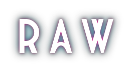

<table border="0" cellspacing="0" cellpadding="0">
<tr>
<td valign="middle" width="55%">

 

📛&nbsp;• `Software Engineering | sometimes Pentester :P`

💻&nbsp; `Systems` • `Reverse Engineering`

 

  

  

  

</td>
<td valign="middle" width="45%" align="center">

</td>
</tr>
</table>

